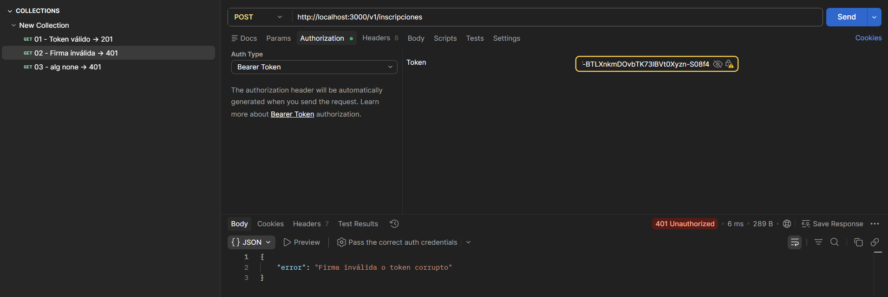

# API Diego

## Uso local

1. Instala las dependencias:

```bash
npm install
```

2. Define el secreto JWT en `.env` o en el entorno. Por ejemplo en PowerShell:

```powershell
$env:JWT_SECRET='secreto-demo-pe23'
npm run dev
```

3. Genera un token JWT válido con el mismo secreto:

```powershell
$env:JWT_SECRET='secreto-demo-pe23'
node .\generate-token.mjs
```

4. Envía la petición a la ruta protegida usando el header `Authorization: Bearer <token>`.

5. Si el token no es válido o no coincide con el secreto del servidor, la respuesta será un error 401 o 500 según el caso.

### Ejemplo de prueba con token inválido

La siguiente captura muestra el error de token inválido cuando el JWT no coincide con el secreto esperado:



## Testing

Run the test suite with:

```bash
npm test
```

Last verified output:

```text
> api_diego@1.0.0 test
> node --experimental-vm-modules ./node_modules/jest/bin/jest.js

(node:20336) ExperimentalWarning: VM Modules is an experimental feature and might change at any time
(Use `node --trace-warnings ...` to show where the warning was created)
(node:11004) ExperimentalWarning: VM Modules is an experimental feature and might change at any time
(Use `node --trace-warnings ...` to show where the warning was created)

Test Suites: 2 passed, 2 total
Tests:       5 passed, 5 total
Snapshots:   0 total
Time:        1.412 s
Ran all test suites.
```

## Validación OpenAPI

Resultado de `npx @redocly/cli lint openapi.yaml`:


## Versionado

Un cambio compatible con versiones anteriores sería agregar un campo opcional como `observaciones` al cuerpo de `POST /v2/incripciones`. Es backwards-compatible porque los clientes existentes pueden seguir enviando exactamente los mismos campos, y el servidor puede tratar el nuevo dato como opcional sin romper la validación ni el contrato anterior.

Un breaking change sería renombrar `payment_method` a `metodoPago` o cambiar su tipo de dato. Eso rompe la compatibilidad porque los clientes actuales ya serializan el campo con el nombre y formato anterior; al cambiarlo, sus peticiones dejarían de cumplir el contrato y comenzarían a fallar con errores de validación o con datos ignorados por el servidor.

## Reflexión: si otro equipo consumiera esta API

Si un equipo externo empezara a integrar esta API mañana, el primer cambio que haría en el contrato OpenAPI sería agregar esquemas de respuesta para los errores de `401` y `400` en todos los endpoints. Hoy el contrato muestra ejemplos, pero no define un formato estándar para los cuerpos de error; documentar eso con un schema reutilizable reduciría la fricción de integración y permitiría a los consumidores manejar fallos de forma consistente.